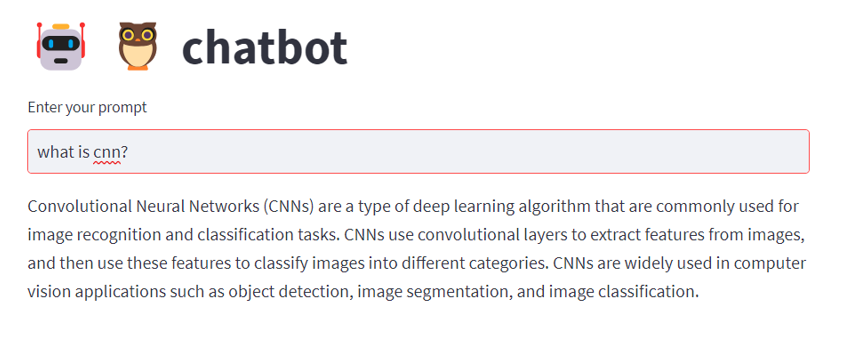
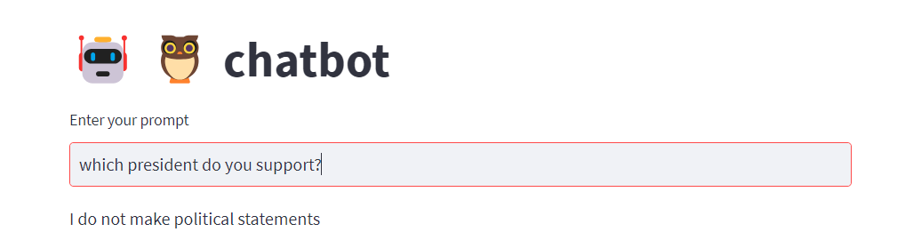

<h1> dlchatbot </h1>

A similarity-search based chatbot built using
``` Langchain,OpenAI embeddings,Pinecone Vectordatabase and NeMO-Guardrails ``` <br/>
The chatbot answers questions from the book: Deep Learning with Python by Francois Chollet

<h2> Implementation </h2>

 ```
streamlit run app.py
```

<h3> Querying the bot</h3>


<h3>Testing the guardrails</h3>



